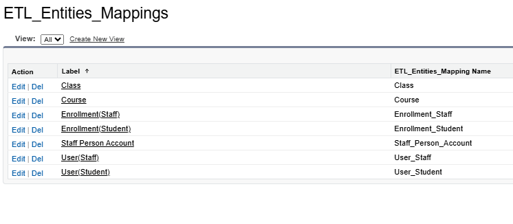
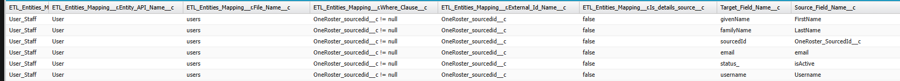

# ETL-service

## Salesforce part

### Data mapping.
    There are 3 custom metada types to manage mappings between SF & UNE csv
    - ETL_Entities_Mapping 
        Reflects sf sObjects to get mapped and some properties
        - Entity API Name // Qualified sf API name
        - External Id Name // Qualified field name 
        - File Name // csv (w/o ext)
        - Is details source // special field that reflects special recordset (like User -> Account)
        - Where Clause // custom where clause used in SOQL statement

    - ETL_Fields_Mapping
        Details for ETL_Entities_Mapping, contains both source & target fields

        - ETL_Entities_Mapping (rel) 
        - Source Field Name 
        - Target_Field_Name

    - ETL_Join
        Describes (in current version inner join) joins. Since salesforce doesn't support 
        custom lookup fields we should use this entity

        - Master Source (rel to ETL_Entities_Mapping)
        - Details Source (rel to ETL_Entities_Mapping)
        - Master FK (in current version relates to Id field in details)

Examples:
### Entities structure


### Staff users


### Full recordset for Staff Users



### Deltas Managing
    There is an object `Watermark__c` that contains last modified date for each mapped object in salesforce. It get used in where clause 
    like 

```bash
WHERE SystemModStamp > :watermark
```

### Exceptions
    Service fires salesforce platform event on exception and it get handled inside saleforce (loggin & warning users)

### Deletion mgmnt

        All deleted records are stored in Deletion_Log__c object and reflected in csv in `status` column as `D` 
    (along with `C` for created records and `U` for updated). For Users direct deletion is not supported  in 
    salesforce so `isActive` field  reflects status.